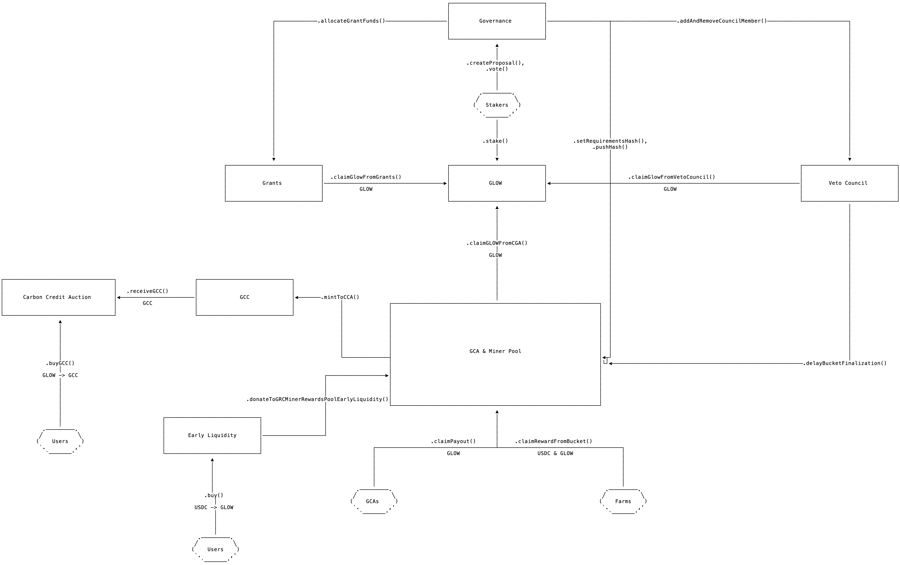

# Glow Contracts

## Guarded Launch
The Guarded Launch is a beta of sorts for the Glow Protocol.
During the guarded launch phase, contracts are deployed as normal with the exception of premine and early liquidity contracts. Furthermore, USDC is replaced with a wrapper called USDG which only allows transfers to allow-listed contracts (specific uniV2 pools). This is in effort to be able to recover from a disaster scenario. GLOW and GCC also follow the same pattern. All three contracts mentioned above also have circuit breakers that can be called by any veto council member in order to halt the transfer of any tokens. After the Guarded Launch, the contracts will be redeployed and airdrops will take place to compensate those that were earning guarded launch rewards.


## External Dependencies
1. OpenZeppelin ERC20 
    -   Used as the base tokens for USDG, GCC, and GLOW
2. Openzeppelin ERC20Permit
    -   Used as the base tokens for USDG, GCC, and GLOW
3. OpenZeppelin SafeCast
    -   Used to SafeCast downcasts across contracts.
4. OpenZeppelin Ownable
    -   Used across certain contracts to check for access roles on setters
5. OpenZeppelin SafeERC20
    -   Used across contracts to handle ERC20 transfers. 
    - Specifically in :
        -   EarlyLiquidity
        -   HoldingContract
        -   MinerPoolAndGCA
6. OpenZeppelin SignatureChecker
    -   Used across contracts to check for ECDSA and EIP1271 signatures
7. OpenZeppelin EIP712
5. Solady Math (SQRT Function)
    -   Used in ImpactCatalyst
6. Solady MerkleProofLib   
    -   Used in MinerPoolAndGCA to check for leaves in the report merkle roots
7. Uniswap V2 Library
    -   Used in ImpactCatalyst 
    -   Used in GlowGuardedLaunch,GCCGuardedLaunch, and USDG to determine pair addresses
8. ABDK Math 64x64
    -   Used across contracts
    -   Specifically in:
        -   EarlyLiquidity to calculate a precise price for the sale of GLOW
        -   CarbonCreditDutchAuction to calculate the price with time decay
        -   Governance to determine a user's nominations with decay


# Glow Overview

The Glow protocol is a protocol with a goal to reduce carbon emissions. It proposes an on-chain incentive system to achieve this goal.

At the heart of the protocol are 2 ERC-20 tokens GLOW and GCC (Glow Carbon Credit). GLOW is rewarded to solar farms for carbon credit production; whilst GCC is an ERC20 where 1 GCC is equal to 1 Metric Ton of CO2 offsets. Both GLOW and GCC are inflationary tokens - GLOW’s supply increases by a fixed amount every week; whilst GCC’s supply increase depends on the carbon offset generated by the solar farms.

Every week, appointed GCAs (Glow Certification Agents) report the carbon offset performed by the registered solar farms to the protocol. Solar farms are rewarded in GLOW and USDC based on their production that is reported every week, and GCC is minted according to the amount specified in the reports. The GCAs are also awarded with a fixed amount of GLOW every week from the inflation.

The GCAs are appointed and overseen by the protocol’s governance. To combat fraudulent reporting - a council (the Veto Council) is appointed with the power to delay the finalization of the reports.

In addition to serving as a token to trade for GCC, GLOW also serves as a governing token governing the entire Glow protocol. Holders of GLOW are able to stake GLOW to obtain ratify/reject votes that can be used to ratify/reject proposals that have been selected for review. Examples of proposals available to be created and voted on include:


## Governance Proposals
Governance has 5 types of proposals. Proposals are created by spending nominations. The cost to create a proposal grows by 10% for each active proposal. Proposals are active for 16 weeks after they are created. Once created, other nomination holders can use their nominations to elect a proposal. Each week, the proposal with the most nominations is elected as the 'most popular proposal'. Once elected, there is a 4 week period in which the proposal is reviewed by the veto council and ratified/rejected by glow stakers. If the proposal is ratified and is not-vetoed by the veto council, its intents are acted upon and result in state changes for the ecosystem. Below are the 5 types of governance proposals.

1. Veto Council Elections
    - A veto council election can at most add and remove exactly one council member at a time.
    - There are at most 7 veto council members at one point in time.
    - Veto council elections cannot be vetoed
    - Veto council elections must be ratified by glow stakers
2. GCAs Elections
    - A GCA election can replace all GCA agents in one proposal. 
    - There are at most 5 GCA agents at one point in time.
    - GCA Elections must be ratified by glow stakers.
    - GCA Elections cannot be vetoed
    - If a GCA Election slashes GCA's that triggers a slash event which 
3. Grants Proposals
    - Grants proposals define a receiver and an amount of GLOW.
    - Grants proposals do not have to be ratified by stakers
    - Grants proposals can be vetoed
4. Request For Comment Proposals
    - When an RFC proposal is passed, veto council members must give written feedback on the RFC contents
    - RFC proposals do not have to be ratified by glow stakers
    - RFC Proposals can in theory be vetoed, but they are assumed valid once they get selected as the most popular proposal of the week.
5. Change GCA Requirements
    -  This proposal type changes the requirements that the GCA's should adhere to
    -  Requires ratification from glow stakers
    - Can be vetoed


## Core Contract TLDRs

-   `GLOW.sol`
    -   Glow Token contract(ERC20)
    -   Fixed inflation of 230,000 tokens per week
    -   Used to reward solar farms for solar production
    -   Can be staked to earn ratify/reject votes
    -   Can be purchased through the `EarlyLiquidity.sol` contract

-   `GCC.sol`
    -   Minted 1:1 with CO2 offsets produced by farm
    -   `MinerPoolAndGCA` is the only allowed party that can call the mint function
    - Minted `GCC` is sold via the `CarbonCreditDutchAuction`
    - GCC holders can commit GCC. This swaps their `GCC` for `USDC` and adds liquidity to USDC/GCC UniV2 Pool
        -   Committers earn impact power
        -   Committers also earn `nominations` which they can use to create proposals in `governance`
    - The GCC contract also handles USDC committments where USDC is swapped for `GCC` and the results are used to add liquidity to the USDC/GCC UniV2 Pool
    - Nominations are earned as the result of sqrt(amount `GCC` added to LP * amount `USDC` added to LP) from the commit actions
    - Commits happen through the `ImpactCatalyst` contract.

- `ImpactCatalyst.sol`
    -   This contract carries the logic for committing `USDC` and `GCC`.
    -   It may only be called by `GCC`

-   `BucketSubmission.sol && GCASalaryHelper.sol && GCA.sol && MinerPoolAndGCA.sol`
    -   These contracts make up the GCA contract and the Miner Reward Contracts.
    -   GCA's report weekly about Carbon Credit Production
        -   They report total offsets produced as well as how to distribute rewards
    - GCA's have 1 week to submit the report. The report then has a week finaliation period.
        -   During the finalization period, the entire bucket can be delayed by the `Veto Council`
    - Governance can slash and replace GCA's
    - GCA's are paid a weekly salary and decide amongst themselves how to allocate the GLOW reserved for GCA payouts (10,000 per week)
    - Once buckets are finalized, farms can claim rewards and GCC is minted to the Carbon Credit Auction.
        - USDC rewards are withheld for 1 week before finally being able to be released to the farm.
        - This occurs in `HoldingContract.sol`
        
-   `HoldingContract.sol`
    -   This contract holds the USDC rewards for farms.
    -   When a holding is added, farms must wait one week before being able to claim the amount in the holding
    -   Holdings can be delayed by 90 days by the `VetoCouncil`

- `Governance.sol`
    -   Entry point to create proposals
    -   Entry point to use ratify/reject votes
    -   Stores nomination count for users
    -   Executes proposals
-   `VetoCouncil.sol`
    - The veto council is responsible for delaying fraudulent buckets
    - The veto council also has the power to delay all Holdings from `HoldingContract.sol` by 90 days.
    - The veto council also has the power to veto non-election proposals.
    - The veto council is managed by governance and are paid a weekly salary in GLOW.

-   `EarlyLiquidity.sol`
    - The early liquidity contract receives 12 million glow on protocol creation
    - It sells glow for USDC at a starting price of 10 cents.
    - The price grows exponentially with the price doubling every 1 million token sales.
    - Tokens are sold in increments of .01 GLOW

-   `CarbonCreditAuction.sol`
    -   The carbon credit auction receives all newly produced GCC and sells it for GLOW.
    - The starting price is .1 GLOW per GCC
    - The price has a half life of 1 week
    - For every sale made, the price increases by the % of the total sold that the sale was
        - For example, if 10% of the available GCC is sold, then the price increases by 10%
        - If 100% of the available GCC is sold, then the price doubles
    - The max that the price can grow is 2x per 24 hours
    - When new GCC is added, all pending vesting amounts and the new amount are vested over the course of a week
    - There is no cap on the amount of GCC that can be purchased in a single transaction

## Simple Flow
</img>

| Contract | LOC | Comments |
| --- | --- | --- |
| IGrantsTreasury.sol | 13 | 51 |
| VestingMathLib.sol | 32 | 24 |
| GrantsTreasury.sol | 51 | 82 |
| BatchCommit.sol | 27 | 59 |
| IGCC.sol | 89 | 204 |
| GCA.sol | 450 | 389 |
| MinerPoolAndGCA.sol | 258 | 233 |
| GCC.GuardedLaunch.sol | 64 | 77 |
| BucketSubmission.sol | 101 | 164 |
| IMinerPool.sol | 46 | 67 |
| GCASalaryHelper.sol | 192 | 195 |
| CarbonCreditDutchAuction.sol | 124 | 113 |
| IEarlyLiquidity.sol | 14 | 33 |
| IGlow.sol | 53 | 113 |
| HalfLifeCarbonCreditAuction.sol | 17 | 17 |
| IGovernance.sol | 101 | 125 |
| ICarbonCreditAuction.sol | 9 | 30 |
| GLOW.sol | 332 | 268 |
| EarlyLiquidity.sol | 105 | 195 |
| VetoCouncilSalaryHelper.sol | 209 | 195 |
| Governance.sol | 821 | 604 |
| USDG.sol | 88 | 112 |
| HoldingContract.sol | 107 | 181 |
| GlowUnlocker.sol | 61 | 49 |
| Glow.GuardedLaunch.sol | 97 | 102 |
| VetoCouncil.sol | 79 | 76 |
| ImpactCatalyst.sol | 202 | 198 |
| IERC20Permit.sol | 6 | 0 |
| GCC.sol | 293 | 247 |
| IGCA.sol | 77 | 142 |
| IVetoCouncil.sol | 14 | 47 |
| HalfLife.sol | 14 | 16 |
| Total | 4146 | 4408 |


## Requirements
* Rust Installed
* NodeJS Installed
* Python3 Installed

## Commands

### Install
```make install```

## Test
```make test.all```


#### Set Your Environment Variables
```env
EARLY_LIQUIDITY_NUM_RUNS = 100
EARLY_LIQUIDITY_DEPTH_PER_RUN = 500
SAVE_EARLY_LIQUIDITY_RUNS = false
SAVE_RETIRE_RUNS=false
ETHERSCAN_API_KEY = ""
GOERLI_RPC_URL="https://goerli.infura.io/v3/..." #for fork testing
PRIVATE_KEY="" # for deployments
MAINNET_RPC="" # for deployments
```
